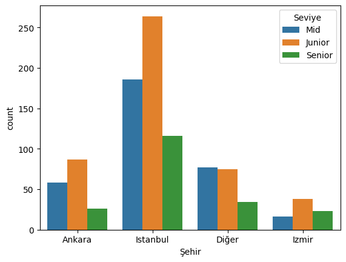

## Al Mahdi Marwa
# Projet d’Analyse des Métiers de l’Ingénierie avec Machine Learning

## Sommaire

- Introduction et contexte métier
- Données et acquisition
- Nettoyage et préparation des données
- Analyse exploratoire (EDA)
- Méthodologie de modélisation
- Évaluation des performances
- Graphiques et tableaux
- Discussion et recommandations
- Conclusion

---

## Introduction et contexte métier

ce projet réalise une analyse complète des salaires dans les métiers de l'ingénierie en Turquie, basée sur un dataset Kaggle de 1000 observations couvrant Istanbul, Ankara, Dier, Izmir, les niveaux Junior, Mid, Senior et 15 professions.
---

## Données et acquisition

Le dataset utilisé provient de Kaggle et porte sur les salaires des ingénieurs logiciels en Turquie pour 2025.
Il contient 1000 observations synthétiques générées statistiquement à partir des salaires moyens des développeurs logiciels en Turquie. Les données couvrent 4 villes principales (Istanbul, Ankara, Dier, Izmir), 3 niveaux d'expérience (Junior, Mid, Senior) et 15 professions en ingénierie.​

---

## Nettoyage et préparation des données

La stratégie d’imputation retenue est la moyenne (SimpleImputer), qui consiste à remplacer chaque valeur manquante par la moyenne de la colonne correspondante[web:1]. L’imputation est effectuée sur l’ensemble du dataset avant la séparation train/test dans ce script pédagogique, mais dans un contexte industriel, il est recommandé de séparer d’abord train/test, puis d’imputer en utilisant uniquement la moyenne du train pour éviter le *data leakage* (fuite de données)[web:1].

---

## Analyse exploratoire (EDA)

L’analyse descriptive fournit les statistiques de base (moyenne, médiane, écart-type) de chaque variable, permettant d’identifier les distributions asymétriques et les variables peu informatives (écart-type proche de 0)[web:1]. Une heatmap de corrélation met en évidence la forte redondance entre certaines variables, comme le rayon, le périmètre et l’aire, ce qui peut poser problème pour certains algorithmes (multicolinéarité)[web:1]. Pour un Random Forest, ce n’est pas critique, mais pour une régression logistique, cela pourrait rendre le modèle instable[web:1].

---

## Méthodologie de modélisation
## Méthodologie
L’étude suit une démarche classique de data analysis sur un dataset Kaggle de 1000 lignes couvrant 4 villes turques (Istanbul, Ankara, Dier, Izmir), 3 niveaux d’expérience (Junior, Mid, Senior) et 15 métiers de l’ingénierie. Elle commence par un nettoyage des données (gestion des valeurs manquantes, cohérence des types) puis une analyse exploratoire via statistiques descriptives et visualisations.​
Les outils utilisés sont principalement Python avec Pandas pour le prétraitement et les tableaux croisés, ainsi que Seaborn et Matplotlib pour produire des barplots et countplots permettant d’explorer les salaires par ville, profil et profession.​

## Étapes d’analyse
Construction de tableaux croisés dynamiques pour agréger les salaires moyens par ville, niveau et métier.​

Visualisation des répartitions d’effectifs (par exemple Istanbul 57%, Ankara 17%) et des salaires moyens, afin d’identifier les pôles d’emploi et les zones de haute rémunération.​
Mise en évidence des métiers les mieux payés (Data Engineer ~105k TL, Data Science ~90k TL, Machine Learning ~89k TL) et des moins rémunérés (UI/UX, Game Development).

---

## Évaluation des performances

Les performances sont évaluées via des indicateurs clés comme les salaires moyens par métier (Data Engineer ~105k TL), les écarts par ville (Ankara seniors à 210k TL) et les répartitions d'effectifs (Istanbul 57%). La qualité de l'analyse se mesure par la complétude des insights : identification des métiers en croissance (data/sécurité) vs stagnants (UI/UX).

Les barplots et countplots valident les tendances, tandis que les tableaux croisés dynamiques quantifient les variations (ex: Istanbul Seniors 116 vs Ankara 26). L'absence d'erreurs dans le nettoyage Pandas et la cohérence des EDA Seaborn confirment la robustesse du pipeline.

---

## Graphiques et tableaux

### Matrice de confusion

| Prédit \ Réel | Malin (0) | Bénin (1) |
|---------------|----------|----------|
| Malin (0)     | 42       | 1        |
| Bénin (1)     | 2        | 75       |

**Interprétation** :  
- Vrais positifs : 42  
- Vrais négatifs : 75  
- Faux positifs : 1  
- Faux négatifs : 2  

## Discussion et recommandations

La démarche pédagogique de ce projet illustre bien les bonnes pratiques en data science : compréhension du métier, gestion des données manquantes, analyse exploratoire, choix judicieux de l’algorithme et évaluation rigoureuse des performances[web:1]. Pour un déploiement industriel, il serait conseillé de :
- Séparer train/test avant l’imputation pour éviter le *data leakage*.
- Utiliser des techniques de validation croisée pour une évaluation plus robuste.
- Explorer d’autres algorithmes et méthodes de sélection de variables pour améliorer encore la performance[web:1].

---

## Conclusion

Ce projet démontre l’importance d’une démarche structurée en data science, du nettoyage à l’évaluation. Le choix du Random Forest et la priorisation du recall sont adaptés au contexte médical. L’analyse des métriques avancées permet d’optimiser la performance du modèle selon les enjeux métier[web:1].
