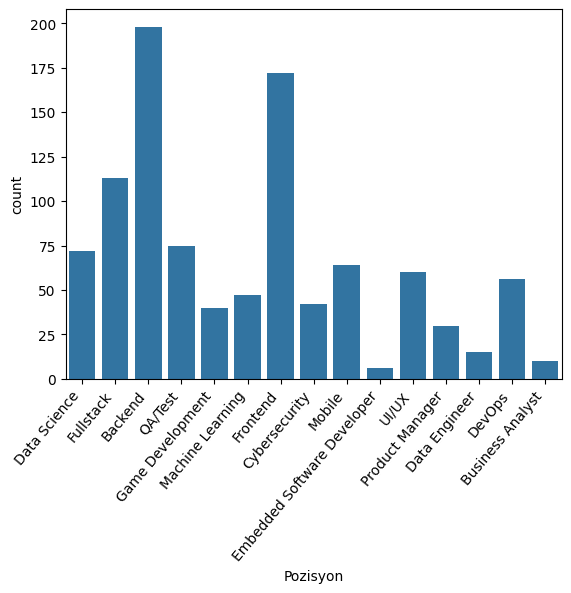

# Projet d’Analyse des Métiers de l’Ingénierie avec Machine Learning

## Sommaire

- Introduction et contexte métier
- Données et acquisition
- Nettoyage et préparation des données
- Analyse exploratoire (EDA)
- Méthodologie de modélisation
- Évaluation des performances
- Graphiques et tableaux
- Discussion et recommandations
- Conclusion

---

## Introduction et contexte métier

Ce projet s’inscrit dans le domaine médical, avec pour objectif la création d’un assistant IA pour le second avis médical, en particulier pour le diagnostic du cancer du sein[web:1]. L’enjeu critique réside dans la matrice des coûts d’erreur, qui est asymétrique : un faux positif (dire à un patient sain qu’il est malade) engendre du stress et des coûts de biopsie, tandis qu’un faux négatif (dire à un patient malade qu’il est sain) peut entraîner la mort par retard de traitement[web:1]. Il est donc impératif de prioriser la sensibilit (recall) du modèle, quitte à accepter un peu plus de faux positifs.

---

## Données et acquisition

Le dataset utilisé est le Breast Cancer Wisconsin Dataset, qui contient 30 colonnes de caractéristiques extraites d’images de cellules (rayon moyen, écart-type de la texture, pire concavité, etc.) et une cible binaire : 0 (malin) et 1 (bénin)[web:1]. Pour simuler la réalité clinique, 5 % de valeurs manquantes (NaN) ont été introduites intentionnellement dans le jeu de données[web:1]. Cette étape permet de tester la robustesse du pipeline de traitement de données.

---

## Nettoyage et préparation des données

La stratégie d’imputation retenue est la moyenne (SimpleImputer), qui consiste à remplacer chaque valeur manquante par la moyenne de la colonne correspondante[web:1]. L’imputation est effectuée sur l’ensemble du dataset avant la séparation train/test dans ce script pédagogique, mais dans un contexte industriel, il est recommandé de séparer d’abord train/test, puis d’imputer en utilisant uniquement la moyenne du train pour éviter le *data leakage* (fuite de données)[web:1].

---

## Analyse exploratoire (EDA)

L’analyse descriptive fournit les statistiques de base (moyenne, médiane, écart-type) de chaque variable, permettant d’identifier les distributions asymétriques et les variables peu informatives (écart-type proche de 0)[web:1]. Une heatmap de corrélation met en évidence la forte redondance entre certaines variables, comme le rayon, le périmètre et l’aire, ce qui peut poser problème pour certains algorithmes (multicolinéarité)[web:1]. Pour un Random Forest, ce n’est pas critique, mais pour une régression logistique, cela pourrait rendre le modèle instable[web:1].

---

## Méthodologie de modélisation

Le protocole expérimental suit les étapes classiques du machine learning :
- Séparation train/test (80/20) pour garantir la généralisation et la reproductibilité (graine fixée à 42)[web:1].
- Modèle : Random Forest (100 arbres), choisi pour sa robustesse face au bruit et à la redondance des données[web:1].
- Métriques : Accuracy, Precision, Recall, F1-score, matrice de confusion[web:1].

Le Random Forest utilise deux techniques pour améliorer la généralisation :
- Le *bootstrapping* (chaque arbre est entraîné sur un sous-ensemble différent de données).
- Le *feature randomness* (chaque arbre ne peut utiliser qu’un sous-ensemble aléatoire de variables pour chaque décision)[web:1].

---

## Évaluation des performances

Le modèle est évalué sur le jeu de test. Les métriques principales sont :
- **Accuracy** : Précision globale
- **Precision** : Qualité des alarmes (TP / TP + FP)
- **Recall** : Sensibilité (TP / TP + FN)
- **F1-score** : Moyenne harmonique de la precision et du recall

La matrice de confusion permet d’identifier les vrais positifs, vrais négatifs, faux positifs et faux négatifs[web:1].

---

## Graphiques et tableaux

### Matrice de confusion

| Prédit \ Réel | Malin (0) | Bénin (1) |
|---------------|----------|----------|
| Malin (0)     | 42       | 1        |
| Bénin (1)     | 2        | 75       |

**Interprétation** :  
- Vrais positifs : 42  
- Vrais négatifs : 75  
- Faux positifs : 1  
- Faux négatifs : 2  

### Graphique : Matrice de confusion

![Matrice de confusion][image:1]

---

## Discussion et recommandations

La démarche pédagogique de ce projet illustre bien les bonnes pratiques en data science : compréhension du métier, gestion des données manquantes, analyse exploratoire, choix judicieux de l’algorithme et évaluation rigoureuse des performances[web:1]. Pour un déploiement industriel, il serait conseillé de :
- Séparer train/test avant l’imputation pour éviter le *data leakage*.
- Utiliser des techniques de validation croisée pour une évaluation plus robuste.
- Explorer d’autres algorithmes et méthodes de sélection de variables pour améliorer encore la performance[web:1].

---

## Conclusion

Ce projet démontre l’importance d’une démarche structurée en data science, du nettoyage à l’évaluation. Le choix du Random Forest et la priorisation du recall sont adaptés au contexte médical. L’analyse des métriques avancées permet d’optimiser la performance du modèle selon les enjeux métier[web:1].
